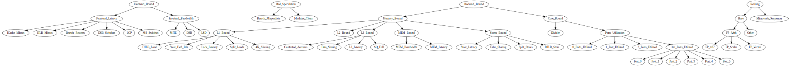

# PERF

`perf` is a tool to profile a process using *Hardware Performance Counters*. Each counter counts *events* in the CPU
such as cycles, executed instructions, loads from a given level of the memory caches, branches...

`perf list` lists the event that are predefined inside the tool.

The easiest way to use `perf` is to profile the whole application (say `./a.out`) using a default set of events

```shell
perf stat --delay 0 -d ./a.out
```

or even

```shell
perf stat --delay 0 -d -d -d ./a.out
```

One can choose a set of events and list them on the command line, for example:

```shell
perf stat --delay 0 -e task-clock -e cycles -e instructions \
-e branch-instructions -e branch-misses \
-e idle-cycles-frontend -e idle-cycles-backend \
-e cache-references -e cache-misses -e L1-dcache-loads -e L1-dcache-load-misses ./a.out
```

The [`doPerf`]({{site.exercises_repo}}/hands-on/architecture/doPerf) script is available, that runs `perf` on an
executable, counting those events.


## Exercise 

### Architecture: Front-end

Consider [branchPredictor.cpp]({{site.exercises_repo}}/hands-on/architecture/branchPredictor.cpp). Compile it with 
```
g++ -Wall -g -march=native branchPredictor.cpp -o branchPredictor -O2 -funroll-all-loops
```

measure its performance with

```
perf stat -d --delay 0 ./branchPredictor
```
Try to enable and disable sorting. What happens?
Explain the behaviour. Modify the code to make it "branchless".

### toplev

Use [backend.cpp]({{site.exercises_repo}}/hands-on/architecture/backend.cpp)

compile 
    
```bash
g++ -Wall -g -march=native
``` 
with different compiler options (`-O2, -O3, -Ofast, -funroll-loops`) measure performance,
identify "hotspot", modify code to speed it up.

You can also try the toplev analysis by: 

```bash
git clone https://github.com/andikleen/pmu-tools.git
cd pmu-tools/
export PATH=$PATH:$(pwd)
```

Then run your program with `toplev`.
You can set the affinity of a program by using `taskset`. 
For example, 

```bash
taskset -c 0 ./out
```

will force the program to run on core 0.

```bash
toplev --single-thread ./out
```
or 

```bash
toplev --all --core C0 taskset -c 0,1 program
```

{:height="400px" }.


A wrapper defining more user-friedly name for INTEL counters can be downloaded as part of `pmu-tools`.

Try:

```bash
ocperf.py list
```

to have a list of ALL available counters (and their meaning)
The actual name of the counters keep changing, so for a detail analysis one has to tailor the events to the actual hardware...

An example (tailored to the Skylake-avx512 machine also available used for the exercise) see
[`doOCPerfSX`]({{site.exercises_repo}}/hands-on/architecture/doOCPerfSX)

The "TopDown" metodology and the use of toplel tool is documented in
https://github.com/andikleen/pmu-tools/wiki/toplev-manual
and in the excellent slides by A.Y. himself
http://www.cs.technion.ac.il/~erangi/TMA_using_Linux_perf__Ahmad_Yasin.pdf

## Further information

For large applications more details can be obtained running 
```bash
perf record
```

that will produce a file containing all sampled events and their location in the application.

```bash
perf record  --call-graph=dwarf
``` 
will produce a full call-graph. On more recent Intel hardware (since Haswell)
one can use 

```bash
perf record  --call-graph=lbr
```

which is faster and produces a more compact report.
```bash
perf report
```
can be used to display the detailed profile.
To identify performance "hotspot" at code level compile with `-g` and `perf report` will interleave source code with assembler.

`perf record/report` is well documented in
https://perf.wiki.kernel.org/index.php/Tutorial#Sample_analysis_with_perf_report

an interesting reading is also
https://stackoverflow.com/questions/27742462/understanding-linux-perf-report-output


